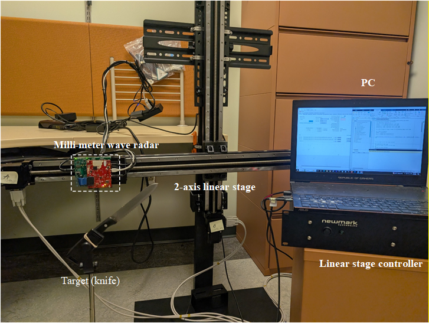
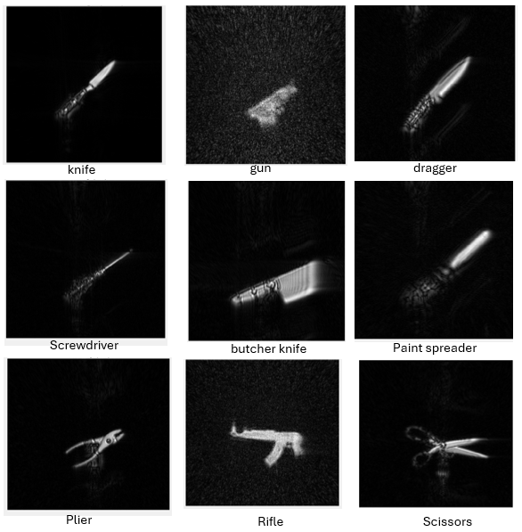
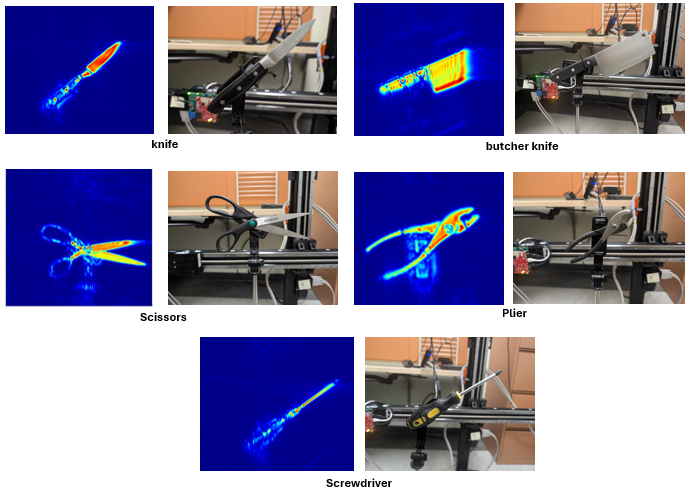
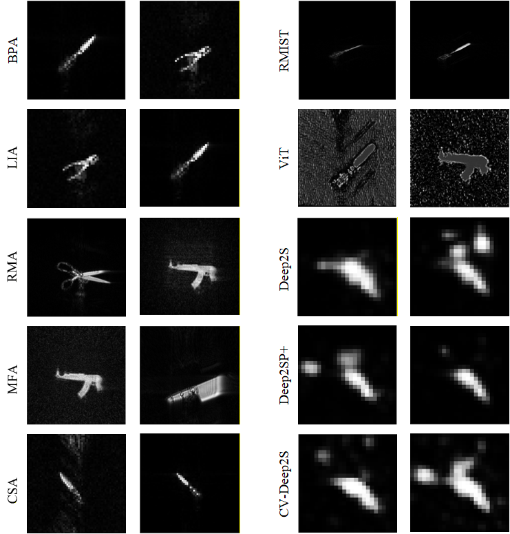

## Near-field SAR milli-wave imaging
This repository provides code for near-field millimeter-wave imaging based on an experimental measurement platform. The platform consists of a TI IWR1843BOOST radar sensor (76–81 GHz), a DCA1000 evaluation module for high-speed raw data capture and streaming, a two-axis mechanical scanning stage, a motion controller, and a host PC for measurement control, signal processing, and image generation.

***

### Our experimental test bed

  

*** 
### Example SAR Images

  

  

*** 

### SAR image reconstruction using classical and DNN based algorithms

  

### Generate sar images 
Run `generate_sar_image.m` to reconstruct a SAR image from the experimental raw data.  
choose:
1. the dataset name
2. the reconstruction algorithm
